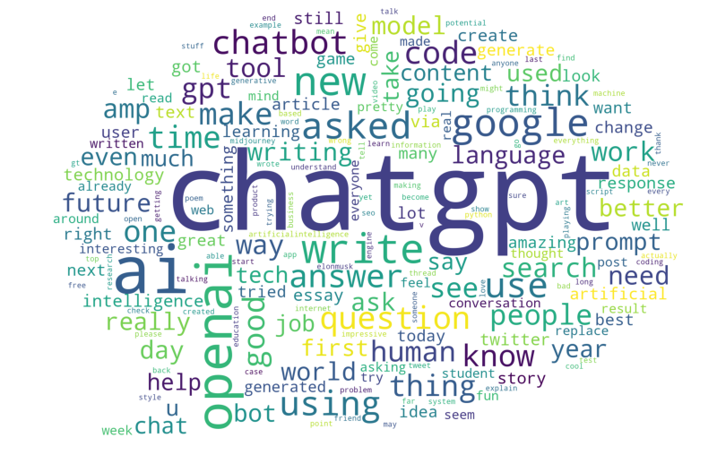

# Sentiment Analysis con BERT

## Descrizione
Questa repository è relativa all'implementazione un modello di Sentiment Analysis utilizzando il modello pre-addestrato BERT (Bidirectional Encoder Representations from Transformers). 
Il modello è raffinato (fine-tuning) sul task di classificazione di recensioni su chatGPT per classificare il sentiment come positivo, neutro o negativo.
Il dataset utilizzato è scaricabile al seguente [link](https://www.kaggle.com/datasets/charunisa/chatgpt-sentiment-analysis).

## Requisiti
- Python 3.9 o versioni successive
- Dipendenze Python: pandas, numpy, statsmodels, transformers, torch, sklearn

## Pipeline
- Acquisizione dei dati
- Pre-processing
- Tokenizzazione
- Encoding
- Addestramento del modello (training, tasting and validation)
- Valutazione dei risultati 

## Autori
Progetto realizzato da:
- [Chiara Gobbi](https://github.com/chiaragii)
- [Alice Moretti](https://github.com/AliceMoretti00)
- [Federica Parlapiano](https://github.com/FedericaParlapiano)
- [Arianna Ronci](https://github.com/AriannaRonci)

